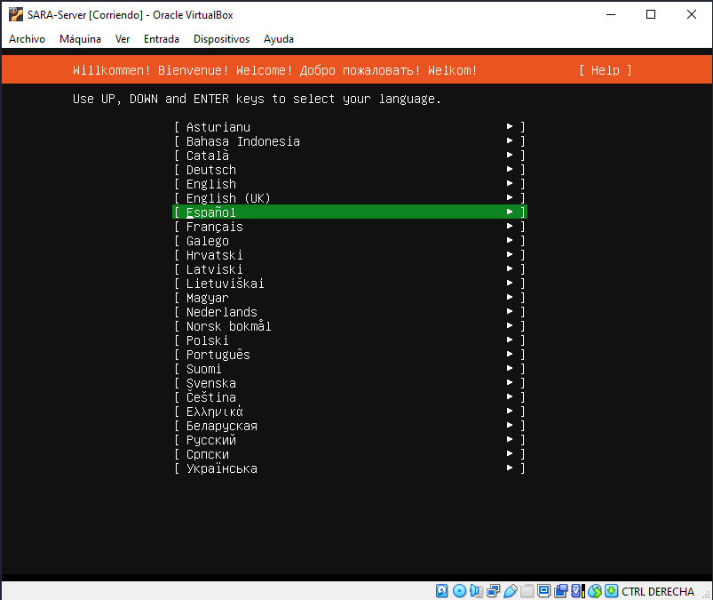
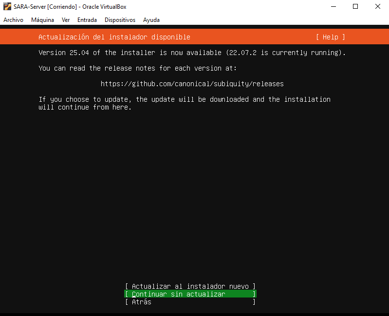
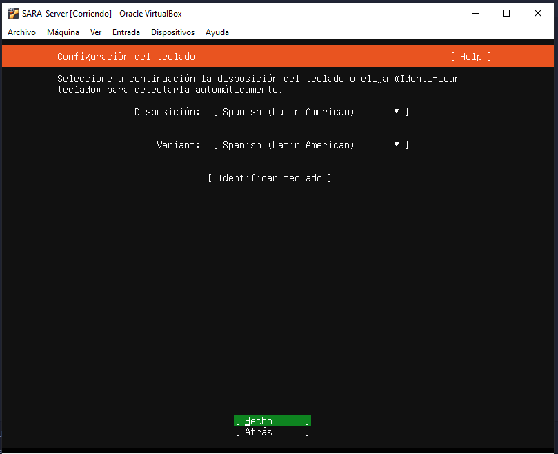
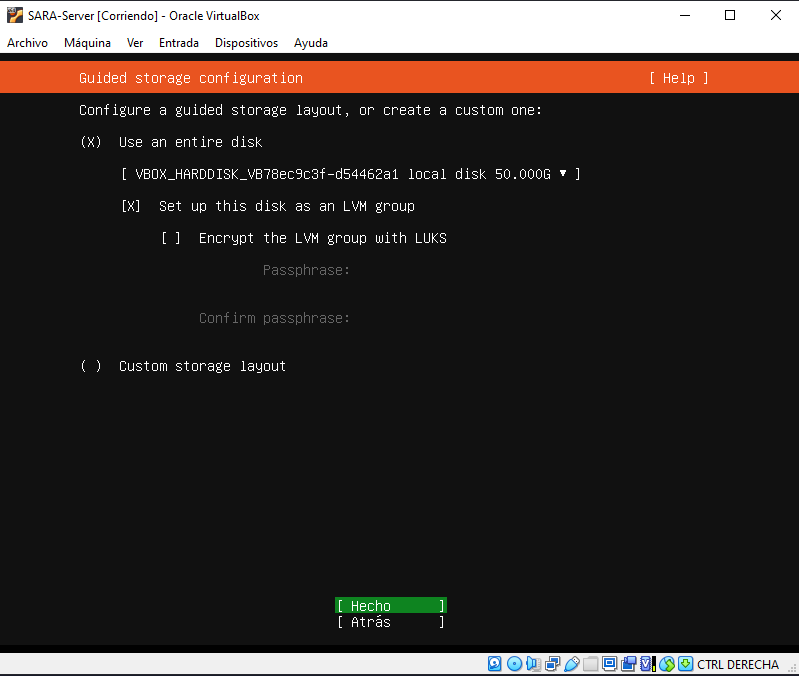
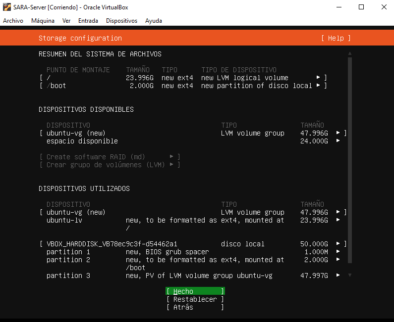
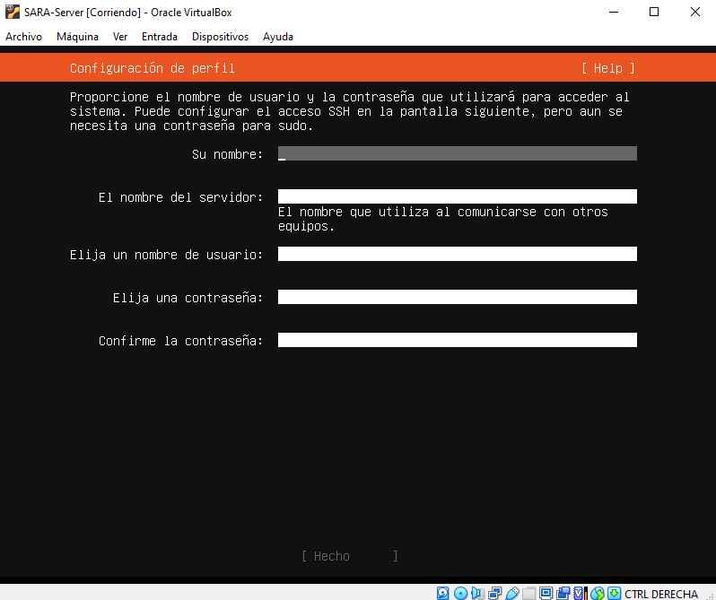
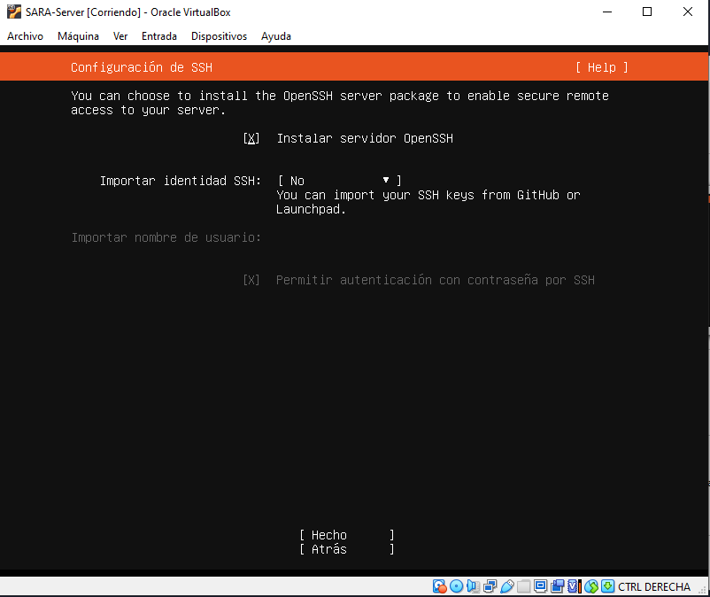
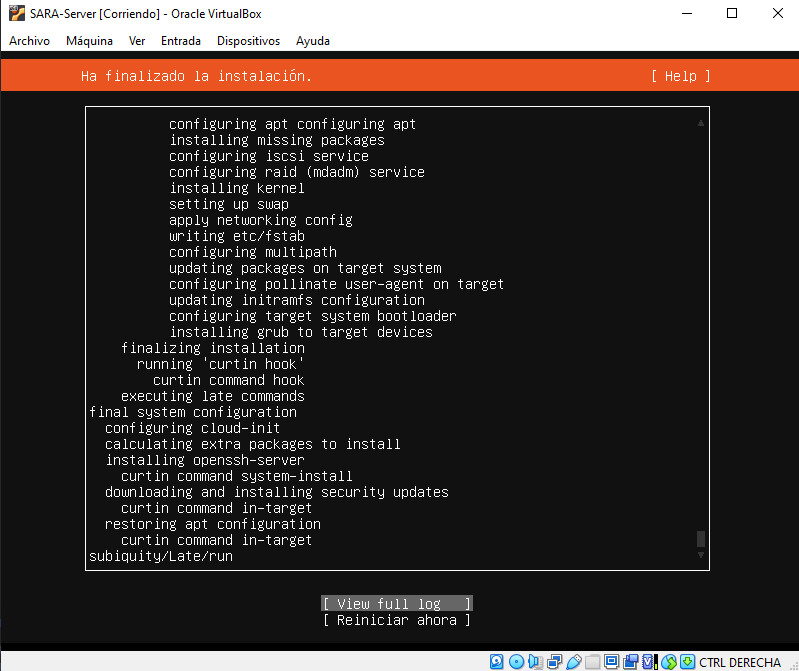
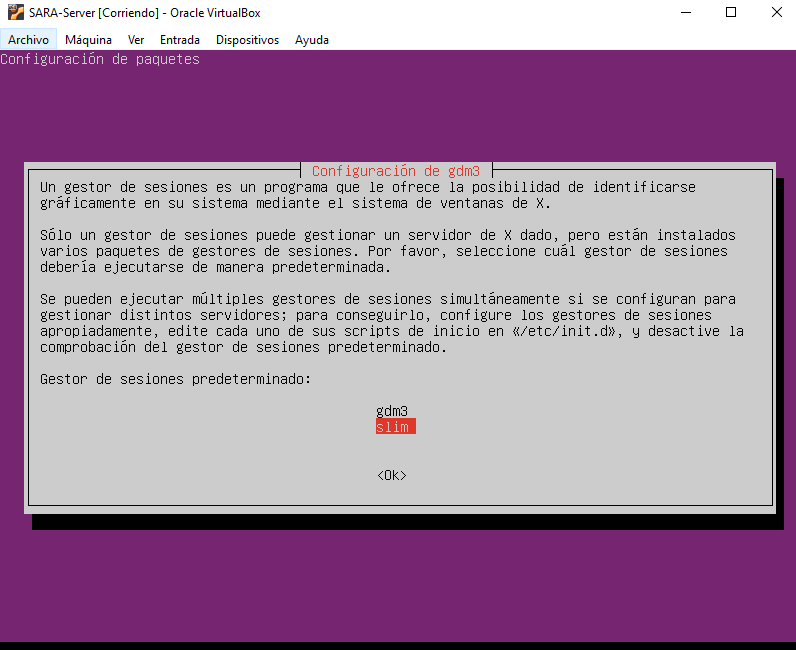
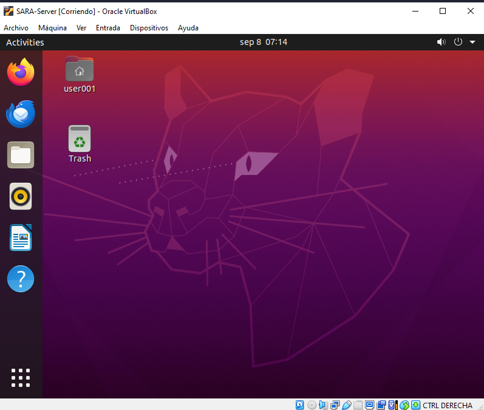

# Configuración inicial del servidor

## Instalación y configuración inicial de Ubuntu Server

### 1. Selección de idioma y actualización





---

### 2. Configuración de almacenamiento

En este paso defines cómo se utilizará el disco para la instalación.

#### Opciones disponibles

- **Usar todo el disco:**  
    Utiliza el disco completo y crea automáticamente las particiones necesarias.

- **Configurar este disco como grupo LVM:**  
    Activa LVM (Logical Volume Manager), permitiendo redimensionar particiones o agregar discos fácilmente en el futuro.

- **Encriptar el grupo LVM con LUKS (opcional):**  
    Protege el disco con cifrado y contraseña al inicio.

- **Diseño de almacenamiento personalizado:**  
    Permite crear y modificar particiones manualmente.



---

### 3. Resumen de la configuración

Antes de continuar, revisa el resumen de la configuración seleccionada.



---

### 4. Configuración del perfil de usuario

Completa los datos del usuario y la contraseña.



- **Instalar Servidor SSH:**  
    Selecciona "Sí" para permitir conexiones remotas SSH.



- **Snaps:**  
    No es necesario seleccionar ningún paquete snap adicional en este paso.

---

### 5. Finalización de la instalación

Si todo se instaló correctamente, aparecerá la opción de reiniciar el sistema.



---

## Instalación de interfaz gráfica en Ubuntu Server

Si deseas agregar una interfaz gráfica, ejecuta los siguientes comandos como superusuario:

```bash
sudo apt-get update
sudo apt-get update
sudo apt install ubuntu-desktop
```

> **Nota:** `slim` es un gestor de inicio ligero. Puedes elegir otro como `gdm3` o `lightdm` según tus preferencias. Nosotros para este 
caso usamos gdm3, que es el recomendado actualmente (Por chatgpt jeje)



Al finalizar la instalación, reinicia el sistema:

```bash
sudo reboot
```



---

¿Listo para continuar?  
Sigue con la [configuración de firewalld](Firewalld.md).