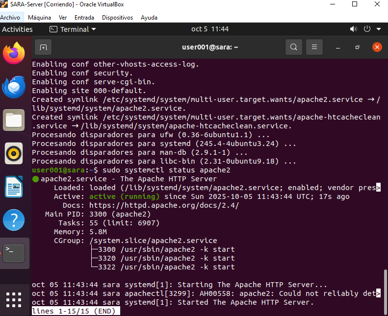
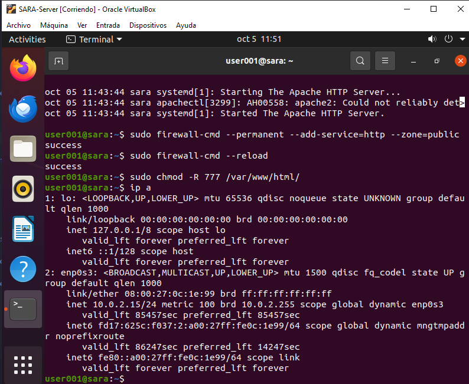
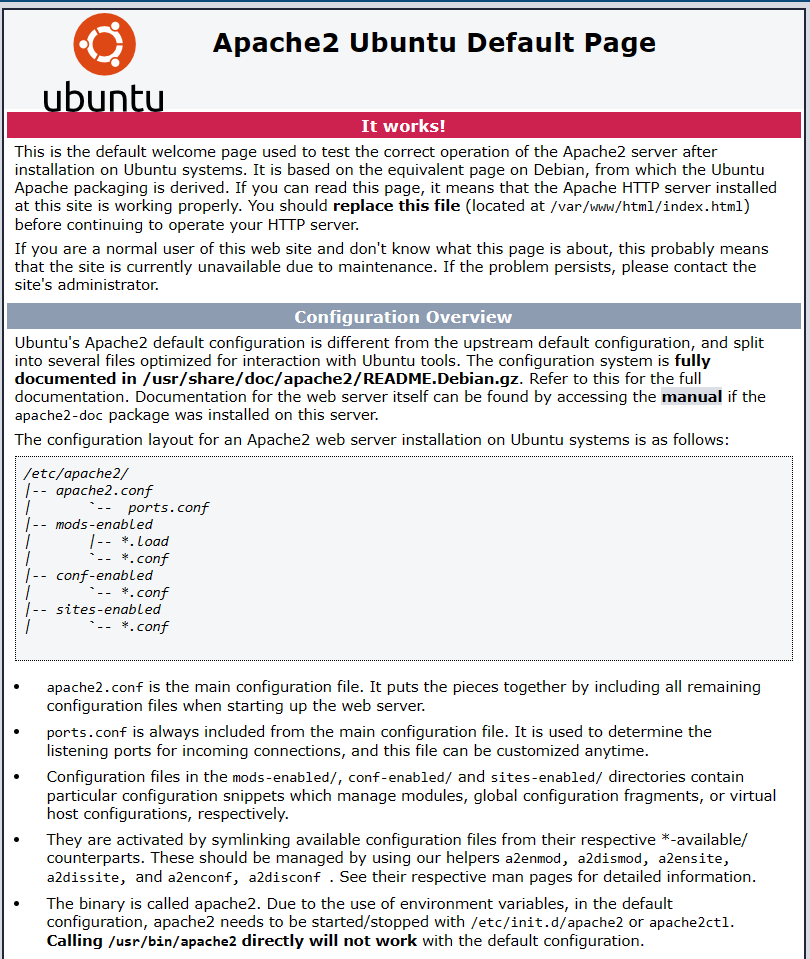

## Instalación y configuración de Apache

A continuación se detallan los pasos para instalar y configurar el servidor web Apache en tu sistema Linux.

### 1. Instalar Apache

Ejecuta el siguiente comando para instalar Apache:

```bash
sudo apt install apache2
```

### 2. Verificar el estado del servicio

Comprueba que Apache se esté ejecutando correctamente:

```bash
sudo systemctl status apache2
```


Si el servicio está activo y en funcionamiento, puedes continuar con la configuración.

### 3. Configurar el firewall

Permite el tráfico HTTP en el firewall para que otros dispositivos puedan acceder a tu servidor web:

```bash
sudo firewall-cmd --permanent --add-service=http --zone=public
sudo firewall-cmd --reload
```


Esto habilita el acceso al puerto 80 (HTTP) en la zona pública del firewall.

### 4. Permitir subir archivos a la página web

Para poder subir y modificar archivos en la carpeta donde se aloja tu sitio web, otorga permisos de escritura:

```bash
sudo chmod -R 777 /var/www/html/
```

> **Nota:** Dar permisos 777 permite que cualquier usuario pueda leer, escribir y ejecutar archivos en esa carpeta. Es útil para pruebas, pero no se recomienda en entornos de producción por motivos de seguridad.

### 5. Comprobar el funcionamiento del servidor

Para verificar que Apache está funcionando correctamente, sigue estos pasos:

1. Desde otra computadora conectada a la misma red (preferiblemente al mismo switch), abre un navegador web.
2. Ingresa la dirección IP del servidor Apache en la barra de direcciones.
3. Si todo está configurado correctamente, deberías ver la página de bienvenida de Apache o el contenido que hayas subido a `/var/www/html/`.




Así confirmas que tu servidor Apache está accesible desde otros dispositivos en la red local.

