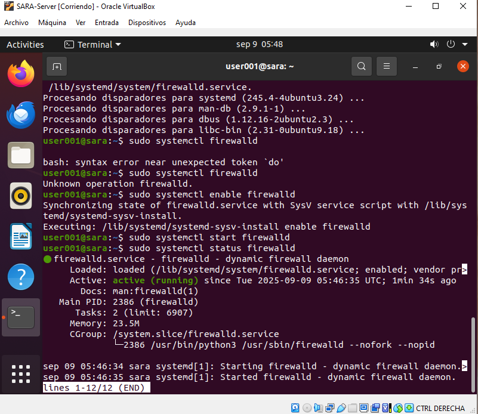
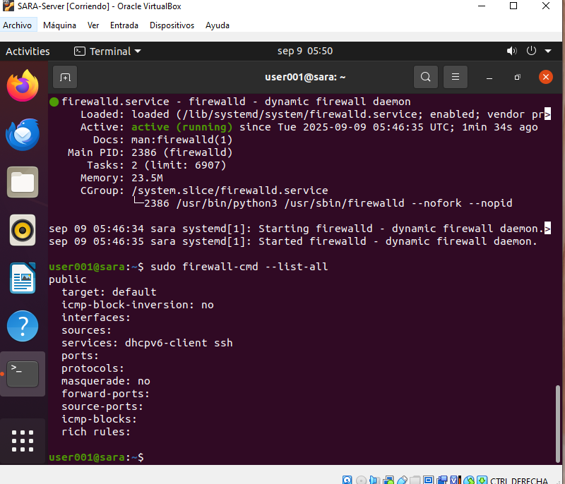

# Configuración de firewalld en Ubuntu Server

## Instalación y configuración básica de firewalld

### 1. Cambiar a usuario root (opcional)

```bash
sudo -i
```

### 2. Actualizar los índices de paquetes

```bash
sudo apt update
```

### 3. (Opcional) Actualizar los paquetes instalados

```bash
sudo apt upgrade -y
```
**NOTA**
el -y es para decir que si a todo.

### 4. Instalar firewalld

```bash
sudo apt install -y firewalld
```

### 5. Habilitar y arrancar firewalld

Activa firewalld para que inicie automáticamente y arráncalo ahora:

```bash
sudo systemctl enable firewalld
sudo systemctl start firewalld
```

### 6. Verificar el estado de firewalld

Para comprobar que el servicio está activo:

```bash
sudo systemctl status firewalld
```



O de forma rápida:

```bash
sudo firewall-cmd --state
```

### 7. Consultar reglas y zonas activas

Para ver la configuración actual de firewalld:

```bash
sudo firewall-cmd --list-all
```



### 8. Control del servicio firewalld

Detener, iniciar o reiniciar el servicio según sea necesario:

```bash
sudo systemctl stop firewalld
sudo systemctl start firewalld
sudo systemctl restart firewalld
```

### 9. Ver logs del servicio

Para revisar los registros de firewalld:

```bash
sudo journalctl -u firewalld --no-pager
```

### 10. Comprobar si UFW está activo (puede interferir)

Si tienes UFW instalado, verifica su estado:

```bash
sudo ufw status
```


## Bloqueo y desbloqueo de conexiones SSH

Para gestionar el acceso SSH mediante `firewalld`, puedes bloquear o permitir el servicio de la siguiente manera:

### 🔒 Bloquear conexiones SSH

El siguiente comando elimina el servicio SSH de las reglas permanentes, bloqueando el acceso remoto por SSH:

```bash
sudo firewall-cmd --permanent --remove-service=ssh
sudo firewall-cmd --reload
```

> ⚠️ **Advertencia:** Asegúrate de no perder el acceso antes de aplicar estos cambios, especialmente si administras el servidor de forma remota.

---

### 🔓 Permitir conexiones SSH

Si necesitas volver a habilitar el acceso SSH, ejecuta:

```bash
sudo firewall-cmd --permanent --add-service=ssh
sudo firewall-cmd --reload
```

---

### 📋 Verificar reglas activas

Comprueba el estado actual de las reglas:

```bash
sudo firewall-cmd --list-all
```

---

> ℹ️ **Consejo:** Documenta cualquier cambio en las reglas del firewall para mantener un control claro sobre la configuración de seguridad de tu servidor.
